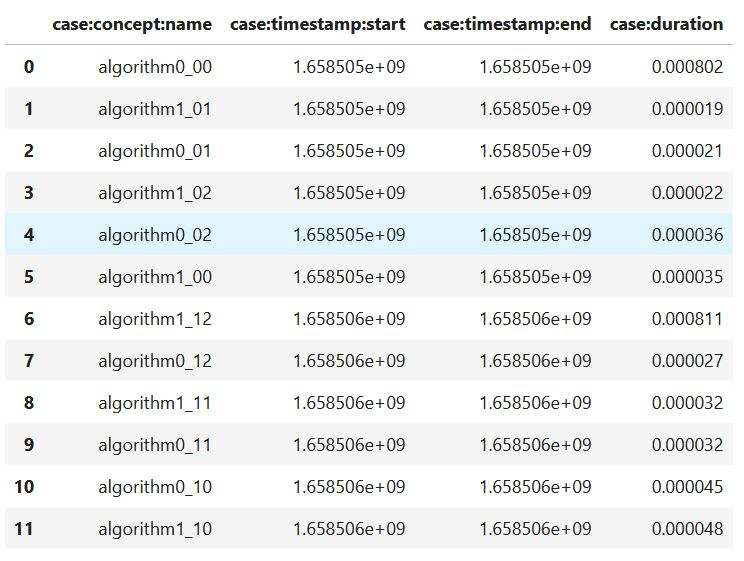

## Runner:

Runners are objects that executes an external command (such as calling a python or julia or bash script). Running the external command outputs a csv file in a format that can be handled by the data_integration sub module. The inputs are the names of the script files that executes the required operation.

The execution of the scripts can either be local, in the backend or submitted to a batch system.

## Input:

Implementation that generates and measures variant codes for an input linear algebra expression. The generated code has timestamps inserted before and after the kernel calls.

# Local Measurements:
### 1. Generate variants for an instance of a linear algebra expression.
An instance refers to an linear algebra expression with a specific operand sizes

```python
operand_sizes = ["75","75","6","75","75"]
script_dir = "sample_generation/"
runner_local = RunnerVariants(operand_sizes, script_dir)
```


Here, generate-variants-linnea.py is a script file that generates variant codes using the Linnea interface

```python
runner_local.generate_variants_for_measurements(generation_script="generate-variants-linnea.py")
```
output:

-1

### 2. Measure variants
Executing generate-variants-linnea.py creates a subdirectory experiments/75_75_6_75_75/, which consists of the generated code and a number of scripts.

```python
!ls sample_generation/experiments/75_75_6_75_75/
```


runner.jl is a script that executes all the variants once and outputs a file run_times.csv that consists of the run time for each variant.

```python
runner_local.measure_variants(app="julia", runner_script="runner.jl")
```
output:

0

```python
!ls sample_generation/experiments/75_75_6_75_75/
```

generate_measurement_scripts.py is a file that generates a measurement script with a specific identifier (run_id) that repeats a given set of variant for a said (rep) numnber of times. For instance, the resulting script for identifier 0 is runner_competing_0.jl

```python
measurements_script = "generate-measurements-script.py"
variants = ['algorithm0', 'algorithm1']
reps = 3
run_id = 0
```
```python
runner_local.generate_measurements_script(measurements_script, variants, run_id, reps)
```
output:

0

```python
!ls sample_generation/experiments/75_75_6_75_75/
```

Executing runner_competing_0.jl measures the variants and outputs a csv file run_times_competing_0.csv consisting of the execution time measurements

```python
runner_competing_script = "runner_competing_0.jl"
runner_local.measure_variants(app="julia", runner_script=runner_competing_script)
```
output:

0

```python
!ls sample_generation/experiments/75_75_6_75_75/
```

### Data integration
This module converts the csv files generated by the runner to pandas data frames.

The input is the directory consisting of the csv files

```python
dc_local = DataCollector("sample_generation/experiments/75_75_6_75_75/")
```
For instance, lets read case_table.csv

```python
dc_local.get_table("case_table.csv")
```
output:


DataCollector offers methods to read the files without having to input the file names, provided the file names adhere to the PA4Algs standards.

```python
case_table = dc_local.get_case_table()
case_table
```

output:


```python
measurements_table = dc_local.get_runtimes_table()
measurements_table
```
output:


### Data processing
The data_proccessing module takes as input the data frames of the case table and the measurement tables (according to the PA4Algs standards) and performs a number of data processing operations.

#### FilterOnKPIs
The FilterOnKPI class filters the variants with the highest FLOP count or execution times within a cretain threshold from the minimum oberved execution time
```python
filterAlgs = FilterOnKPIs(case_table, measurements_table)
```
```python
filterAlgs.filter_on_flops_and_rel_duration(1.2)
```
output:


```python
filterAlgs.filter_on_best_flops()
```
output:


```python
filterAlgs.get_alg_seq_sorted_on_duration()
```
output:


#### CaseDurationManager
In practise, measuremnets from multiple tables have to be aggregated. For instance, in order to measure the relative performance of algorithms in PA4Algs (Algorithm Ranking), the variants are measured iteratively, and the execution times from different csv files have to be combined into a single data frame. To this end, CaseDurationManager class is used

```python
cm = CaseDurationsManager()

run_times_table0 = dc_local.get_runtimes_competing_table(0)
cm.add_case_durations(run_times_table0)

cm.case_durations
```
output:


For instances, let us consider combining measurements from run_times_competing_0.csv and run_times_competing_1.csv. run_times_competing_0.csv s already available. Now lets measure again and get run_times_competing_1.csv

```python
runner_local.generate_measurements_script(measurements_script, variants, 1, reps)
runner_competing_script = "runner_competing_1.jl"
runner_local.measure_variants(app="julia", runner_script=runner_competing_script)
```
output:

0


```python
run_times_table1 = dc_local.get_runtimes_competing_table(1)
```


```python
cm.add_case_durations(run_times_table1)
```

```python
cm.case_durations
```
output:



CaseDurationManager also outputs the measurements as a dictionary in the following format (In order to rank the algorithms using the PA4Algs (Algorithm ranking), the format is required)

```python
cm.get_alg_measurements()
```
output:


### Deleting the directory and the csv files generated by the runner
```python
runner_local.clean()
```
```python
!ls sample_generation/experiments/
```

# Executing Measurements on the Backend
### 1. Instantiate a backend manager
```python
from backend_manager import BackendManager,Commands
import os
```
```python
bm = BackendManager(server="login18-1.hpc.itc.rwth-aachen.de", uname="as641651")
bm.connect()
cmds = Commands(source="~/.analyzer")
```
### 2. Generate variants
```python
operand_sizes = ["75","75","6","75","75"]
script_dir = "sample_generation/" # the path to the directory in the backend
generation_script = "generate-variants-linnea.py"
runner = RunnerVariants(operand_sizes, script_dir,backend_manager=bm, backend_commands=cmds)
```
```python
ret = runner.generate_variants_for_measurements(generation_script=generation_script)
```

output

### 3. Measure variants
```python
runner.measure_variants(app="julia", runner_script="runner.jl")
```
output:

0
### 4. Read Tables
To this end, instantiate the DataCollector class by passing the backend manager. The class synchronizes data from the opoerands directory from the runner to a local directory
```python
local_dir = "sample_generation/cluster/"
backend_dir = runner.operands_dir
```
```python
dc_backend = DataCollector(local_dir,backend_dir,bm)
```
```python
ct_backend = dc_backend.get_case_table()
ct_backend
```
output:


```python
mt_backend = dc_backend.get_runtimes_table()
mt_backend
```
output:


### 5. Filter for competing variants
```python
filterAlgs_backend = FilterOnKPIs(ct_backend, mt_backend)
```
```python
competing_algs_table = filterAlgs.filter_on_flops_and_rel_duration(1.2)
competing_algs_table
```
output:


```python
competing_algs = list(competing_algs_table['case:concept:name'])
competing_algs
```
output:


### 6. Generate measurement scripts for the competing variants in the backend
```python
measurements_script = "generate-measurements-script.py"
variants = competing_algs
reps = 3
run_id = 0
```
```python
runner.generate_measurements_script(measurements_script, variants, run_id, reps)
```
output:

0
### 7.1. Run the measurement script in the backend
```python
runner_competing_script = "runner_competing_0.jl"
runner.measure_variants(app="julia", runner_script=runner_competing_script)
```
output:

0
### 7.2. Execute the measurement script in a batch system
Generate measurement script

```python
run_id = 1
runner.generate_measurements_script(measurements_script, variants, run_id, reps)
```
output:

0

Submit job
```python
submit_cmd = "sbatch submit.sh"
runner_competing_script = "runner_competing_1.jl"
runner.measure_variants(app="julia", runner_script=runner_competing_script, submit_cmd=submit_cmd)
```

output:

0

Check job status
```python
bm.check_slrum_status(runner.job_name)
```
output:

2

Check if file exists
```python
bm.check_if_file_exists(os.path.join(runner.operands_dir, "run_times_competing_1.csv"))
```
output:

True
### 8.Collect data

```python
mt_competing_0 = dc_backend.get_runtimes_competing_table(0)
mt_competing_1 = dc_backend.get_runtimes_competing_table(1)
mt_competing_0.head()
```
output:


